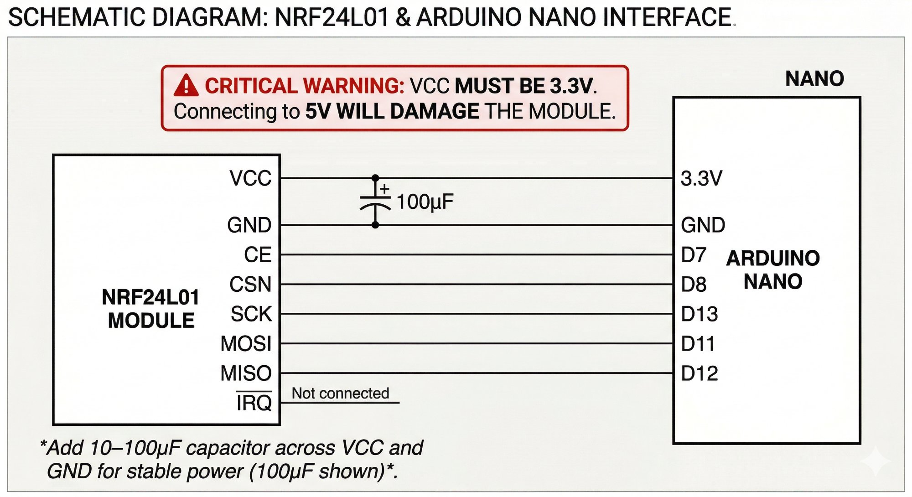
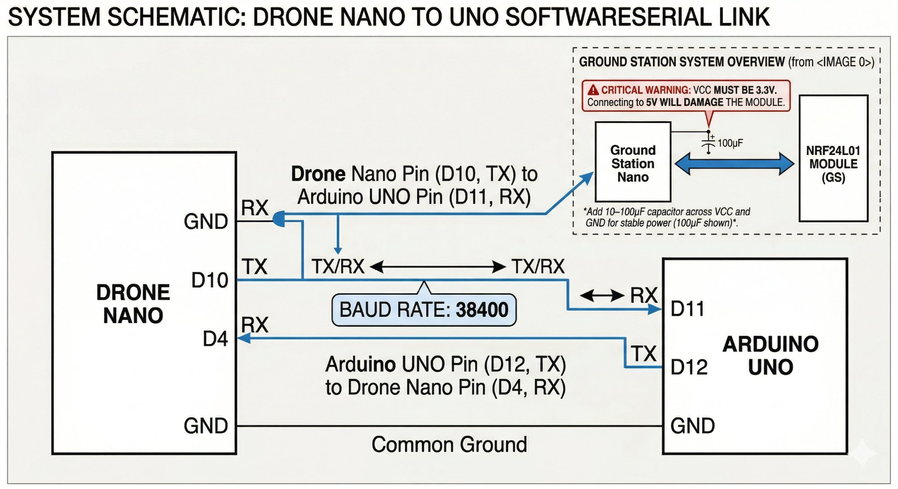
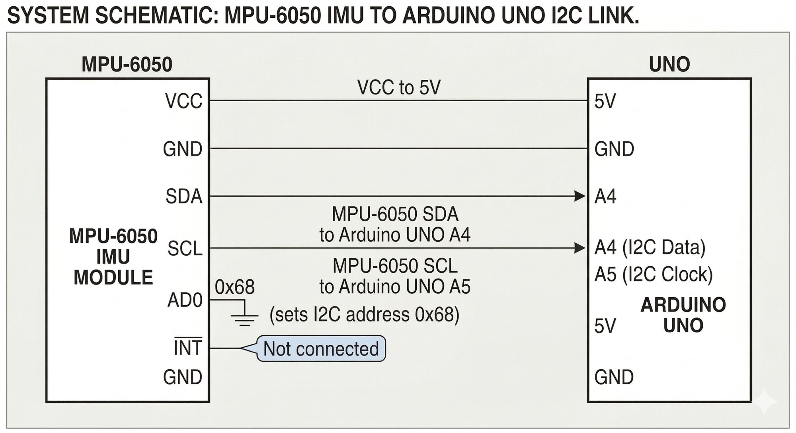
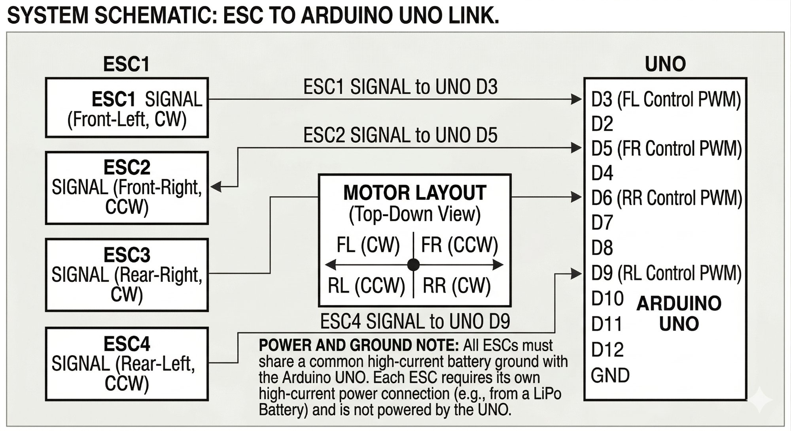

# Wiring Reference — BUMBLEBEE-CP

## NRF24L01 Module (Both Drone Nano & Ground Station Nano)

> ⚠️ VCC must be **3.3V**, not 5V — 5V will damage the module.



| NRF24L01 Pin | Arduino Nano Pin |
|---|---|
| VCC | 3.3V |
| GND | GND |
| CE | D7 |
| CSN | D8 |
| SCK | D13 |
| MOSI | D11 |
| MISO | D12 |
| IRQ | Not connected |

Add a 10–100µF capacitor across VCC and GND on the NRF24L01 for stable power.

---

## Drone Nano → UNO SoftwareSerial Link



| Drone Nano Pin | Arduino UNO Pin |
|---|---|
| D10 (TX) | D11 (RX) |
| D4 (RX) | D12 (TX) |
| GND | GND |

Baud rate: **38400**

---

## MPU-6050 IMU → Arduino UNO



| MPU-6050 Pin | Arduino UNO Pin |
|---|---|
| VCC | 5V |
| GND | GND |
| SDA | A4 |
| SCL | A5 |
| AD0 | GND (sets I2C address 0x68) |
| INT | Not connected |

---

## ESC → Arduino UNO



| ESC | UNO Pin | Motor Position | Direction |
|---|---|---|---|
| ESC1 | D3 | Front-Left | CW |
| ESC2 | D5 | Front-Right | CCW |
| ESC3 | D6 | Rear-Right | CW |
| ESC4 | D9 | Rear-Left | CCW |

Motor layout (view from above):
```
    Front
 FL (CW) | FR (CCW)
 --------+--------
 RL (CCW)| RR (CW)
    Rear
```

---

## Power Distribution

- LiPo → PDB → 4× ESCs (main power)
- ESC BEC → Arduino UNO 5V (or separate 5V BEC)
- Arduino UNO 3.3V → Drone Nano VCC (or dedicated 3.3V regulator)
